# fxwatch: GitOps platform on AWS EKS

A production-style platform built end to end on AWS: infrastructure as code with Terraform, a containerized TypeScript app on EKS, GitOps delivery with ArgoCD, automated CI/CD with GitHub Actions, secrets with automatic rotation, and full observability with Prometheus and Grafana.

The app itself is intentionally small: **fxwatch** tracks daily foreign exchange reference rates (EUR/USD, USD/PHP, and others). The interesting part is everything around it.

> 📸 _Screenshots: live app, ArgoCD tree, Grafana dashboard, PR plan comment (add to `docs/images/`)_

---

## Table of contents

- [Architecture](#architecture)
- [Tech stack](#tech-stack)
- [Repository structure](#repository-structure)
- [How it works](#how-it-works)
- [Design decisions](#design-decisions)
- [Step-by-step build guide](#step-by-step-build-guide)
- [Day-to-day operations](#day-to-day-operations)
- [Cost and teardown](#cost-and-teardown)
- [Troubleshooting: issues hit and how they were fixed](#troubleshooting-issues-hit-and-how-they-were-fixed)
- [Future improvements](#future-improvements)

---

## Architecture

### Runtime

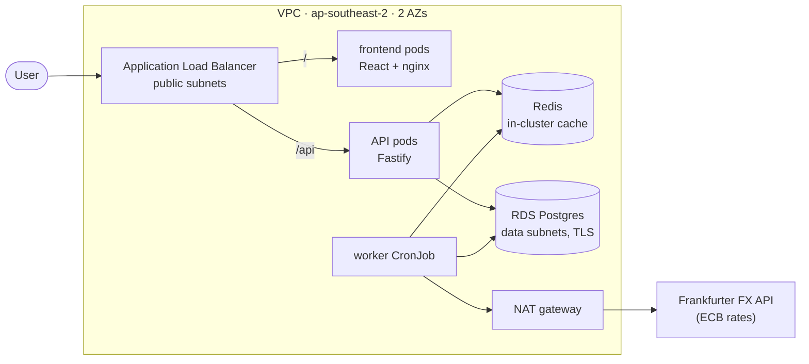

- **Public subnets:** ALB and NAT gateway only.
- **Private subnets:** EKS nodes and all pods. No public IPs.
- **Data subnets:** RDS, with **no route to the internet at all**.

### Delivery (CI/CD + GitOps)

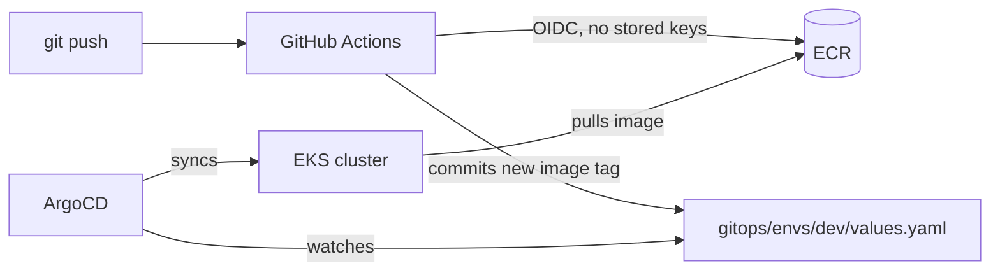

### Secrets

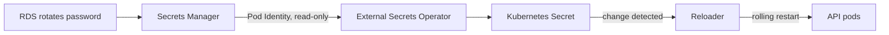

The database password never appears in Git, Terraform state, or CI logs.

---

## Tech stack

| Area                         | Tools                                                                              |
| ---------------------------- | ---------------------------------------------------------------------------------- |
| Cloud                        | AWS (VPC, EKS, ECR, RDS Postgres, Secrets Manager, ALB, IAM)                       |
| Infrastructure as code       | Terraform with local modules + `envs/` layout, S3 remote state with native locking |
| Containers and orchestration | Docker (multi-stage), Kubernetes 1.35 on EKS, Helm                                 |
| GitOps                       | ArgoCD (auto-sync, self-heal, prune)                                               |
| CI/CD                        | GitHub Actions with OIDC, path-filtered builds, plan-on-PR / apply-on-merge        |
| Secrets                      | External Secrets Operator, EKS Pod Identity, Reloader                              |
| Ingress                      | AWS Load Balancer Controller (ALB, IP targets)                                     |
| Observability                | kube-prometheus-stack (Prometheus, Grafana, Alertmanager), prom-client             |
| App                          | TypeScript, Node 24, Fastify, PostgreSQL, Redis, React + Vite, nginx               |

---

## Repository structure

```
eks-gitops-fx-platform/
├── .github/workflows/
│   ├── app.yml               # build changed images, push to ECR, bump tags
│   ├── infra.yml             # terraform plan on PR, apply on merge
│   └── promote.yml           # manual deploy / rollback to an environment
├── app/
│   ├── backend/              # Fastify API + worker (one Dockerfile, two targets)
│   ├── frontend/             # React + Vite, served by nginx
│   └── docker-compose.yml    # local dev: postgres, redis, api, worker
├── gitops/
│   ├── argocd/               # ArgoCD Applications (fxwatch-dev, monitoring)
│   ├── charts/fxwatch/       # Helm chart for the whole app
│   │   ├── files/            # Grafana dashboard JSON
│   │   └── templates/
│   └── envs/dev/values.yaml  # per-environment values (image tags, DB host...)
├── infra/
│   ├── bootstrap/            # state bucket + GitHub OIDC roles (applied manually)
│   ├── modules/              # network, eks, ecr, rds, pod-identity
│   └── envs/dev/             # dev environment, calls the modules
└── scripts/
    └── build-push.sh         # build and push images to ECR
```

---

## How it works

### The app

- **Worker** (Kubernetes CronJob, every 6 hours) fetches rates from the Frankfurter API, **upserts** them into Postgres, and warms the Redis cache. Upserts make it idempotent, so retries are always safe.
- **API** serves `/api/rates`, `/api/rates/:pair`, and `/api/history/:pair` using a **cache-aside** pattern: Redis first, Postgres on a miss, then fill the cache.
- **Frontend** shows the latest rates and a history chart, calling `/api` on the same origin (no CORS needed).
- **Probes:** `/health` (liveness) only checks the process. `/ready` (readiness) checks Postgres. If Redis is down, the API stays ready and serves from the database.

### Deploying a change

1. Push code to `main`.
2. The `app` workflow detects **which** component changed and builds only that one.
3. It pushes the image to ECR, tagged with the **git commit SHA** (ECR tags are immutable).
4. A bot commit updates `backendTag` or `frontendTag` in `gitops/envs/dev/values.yaml`.
5. ArgoCD sees the commit and rolls out the new pods.

Nobody runs `kubectl apply` or `helm upgrade` by hand.

### Changing infrastructure

1. Open a PR touching `infra/envs/**` or `infra/modules/**`.
2. The `infra` workflow posts the `terraform plan` as a PR comment.
3. Merge, and `terraform apply` runs (behind a GitHub environment approval gate).

### Promoting or rolling back

**Actions → promote → Run workflow**, then pick the environment, the component, and optionally a tag. The workflow commits the tag to that environment's values file. Rollback is just promoting an older tag, and every deploy is a Git commit.

---

## Design decisions

**Terraform layout: modules + envs.** Reusable local modules (`network`, `eks`, `ecr`, `rds`, `pod-identity`) are called from per-environment roots. Each root has its own state key. Adding prod means a new `envs/prod` folder with different inputs, not new logic.

**Raw resources vs registry modules.** The VPC is written with raw resources: it's simple, and every route table is understood. EKS uses `terraform-aws-modules/eks` (wrapped in a local module), because the IAM, access entries, add-ons, and security group wiring are complex and already well solved.

**Module defaults are prod-safe; dev overrides them.** For example, RDS defaults to deletion protection and final snapshots, and `envs/dev` explicitly turns them off.

**Bootstrap stays manual.** It manages the OIDC roles CI uses to authenticate. CI changing its own credentials would be like changing the locks while standing outside the door.

**No static AWS credentials anywhere.** GitHub Actions uses OIDC with roles pinned to this repo (by immutable owner/repo IDs) and branch. Pods use EKS Pod Identity, with one narrowly scoped role per workload.

**Least privilege by role.** Separate roles for terraform plan (read-only, PRs), terraform apply (main branch / `dev` environment only), and ECR push (push to `fxwatch-*` repos only).

**RDS-managed master password.** RDS generates and rotates it in Secrets Manager. ESO syncs it into the cluster, and Reloader restarts the API when it changes: **zero-downtime credential rotation**.

**Verified TLS to RDS.** The RDS CA bundle is baked into the image, so the app verifies the database certificate, not just encrypts the connection.

**Hardened pods.** Non-root (numeric UIDs), read-only root filesystem, all Linux capabilities dropped, seccomp `RuntimeDefault`.

**Build once, promote the same image.** Images are tagged by commit SHA and never rebuilt for another environment.

**Spot nodes with two instance types** (`t3.large`, `t3a.large`) for cost savings and better Spot capacity availability.

**Separate image tags per component**, so a frontend change only rebuilds and redeploys the frontend.

**Alerts that are actionable.** The worker alert fires only when a job fails **after all retries**, not on a single retried attempt.

---

## Step-by-step build guide

This is the full sequence used to build the project, in order. Commands are for **Git Bash on Windows** unless marked PowerShell.

Values used throughout (replace with yours):

| Placeholder     | Example                                       |
| --------------- | --------------------------------------------- |
| `<ACCOUNT_ID>`  | your 12-digit AWS account ID                  |
| `<GITHUB_USER>` | your GitHub username                          |
| `<ALB_URL>`     | from `kubectl -n fxwatch get ingress fxwatch` |
| `<RDS_ADDRESS>` | from `terraform output -raw rds_address`      |
| Region          | `ap-southeast-2`                              |

### 0. Prerequisites

Tools: AWS CLI v2, Terraform ≥ 1.10, kubectl, Helm, Docker Desktop, Node 24, Git.

AWS account setup:

1. Enable MFA on the root user, then stop using root.
2. Create an IAM user (or Identity Center user) for daily work.
3. Create an **AWS Budget** with email alerts (e.g. $20 and $50) before creating anything.

Log in and set the profile:

```bash
aws login --profile <profile>
export AWS_PROFILE=<profile>          # PowerShell: $env:AWS_PROFILE = "<profile>"
aws sts get-caller-identity           # confirm the right user and account
```

If Terraform can't find credentials from an `aws login` session (PowerShell):

```powershell
aws configure export-credentials --profile <profile> --format powershell | Invoke-Expression
```

### 1. Bootstrap: state bucket + GitHub OIDC roles

Create the S3 state bucket in `ap-southeast-2` (console or CLI), then:

```bash
cd infra/bootstrap
cp terraform.tfvars.example terraform.tfvars   # set github_owner, github_repo, IDs
terraform init
terraform providers lock -platform=linux_amd64 -platform=windows_amd64
terraform plan
terraform apply
terraform output
cd ../..
```

`import.tf` adopts the existing bucket. If a GitHub OIDC provider already exists in the account, reference it with a `data` source instead of creating it.

### 2. Core infrastructure: VPC, EKS, ECR, RDS

```bash
cd infra/envs/dev
aws eks describe-cluster-versions --region ap-southeast-2 --query "clusterVersions[].clusterVersion"
terraform init
terraform providers lock -platform=linux_amd64 -platform=windows_amd64
terraform fmt -recursive ../../
terraform plan
terraform apply
cd ../../..
```

Connect kubectl and check the cluster:

```bash
aws eks update-kubeconfig --name fxwatch-dev --region ap-southeast-2
kubectl config current-context
kubectl get nodes -L node.kubernetes.io/instance-type
kubectl get pods -n kube-system
```

Test RDS from inside the cluster (RDS is private):

```bash
aws secretsmanager get-secret-value \
  --secret-id "$(terraform -chdir=infra/envs/dev output -raw rds_secret_arn)" \
  --query SecretString --output text

kubectl run pg-test --rm -it --image=postgres:17-alpine --restart=Never -- \
  psql "host=<RDS_ADDRESS> user=fxwatch_admin dbname=fxwatch sslmode=require"
```

Type the password only at the prompt, never on the command line.

### 3. Run the app locally

```bash
cd app/backend
npm install
cd ..
docker compose up --build -d
```

```bash
curl localhost:3000/health
curl localhost:3000/api/rates
curl localhost:3000/api/rates/USDPHP        # "source": "db" first time
curl localhost:3000/api/rates/USDPHP        # "source": "cache" second time
curl "localhost:3000/api/history/EURUSD?days=7"
curl -s localhost:3000/metrics | grep http_request_duration_seconds_count
docker compose run --rm worker              # run the worker again
docker compose exec redis redis-cli DEL rate:USDPHP   # force a cache miss
docker compose logs api --tail=30
```

Optional: run the API outside Docker with auto-reload, using `app/backend/.env` (`PGHOST=localhost`...):

```bash
docker compose up postgres redis -d
cd backend
npm run dev:worker
npm run dev:api
```

Frontend dev server (proxies `/api` to `localhost:3000`):

```bash
cd app/frontend
npm install
npm run dev                                 # http://localhost:5173
```

Check the nginx config and container:

```bash
docker build -t fxwatch-frontend-test app/frontend
docker run --rm fxwatch-frontend-test nginx -t
docker run --rm -p 8090:8080 fxwatch-frontend-test
```

### 4. Build and push images

```bash
git update-index --chmod=+x scripts/build-push.sh   # once, so Linux CI can run it
git ls-files -s scripts/build-push.sh               # should start with 100755

export AWS_PROFILE=<profile>
./scripts/build-push.sh backend     # api + worker
./scripts/build-push.sh frontend
./scripts/build-push.sh all
```

The script refuses to run with uncommitted changes (the tag must match committed code) and skips tags that already exist in ECR.

```bash
aws ecr describe-images --repository-name fxwatch-api --region ap-southeast-2 \
  --query "imageDetails[].imageTags"
aws ecr describe-image-scan-findings --repository-name fxwatch-api \
  --image-id imageTag=<TAG> --region ap-southeast-2 \
  --query "imageScanFindings.findingSeverityCounts"
```

### 5. First deploy with Helm (before GitOps)

```bash
kubectl create namespace fxwatch

SECRET_JSON=$(aws secretsmanager get-secret-value \
  --secret-id "$(terraform -chdir=infra/envs/dev output -raw rds_secret_arn)" \
  --query SecretString --output text)

kubectl -n fxwatch create secret generic fxwatch-db \
  --from-literal=PGUSER="$(node.exe -pe 'JSON.parse(process.argv[1]).username' "$SECRET_JSON")" \
  --from-literal=PGPASSWORD="$(node.exe -pe 'JSON.parse(process.argv[1]).password' "$SECRET_JSON")"

unset SECRET_JSON
kubectl -n fxwatch describe secret fxwatch-db      # shows sizes, not values
```

Use `node.exe`, not `node`, in Git Bash. The `node` alias goes through `winpty`, which breaks inside `$(...)`.

```bash
helm template fxwatch gitops/charts/fxwatch -f gitops/envs/dev/values.yaml
helm upgrade --install fxwatch gitops/charts/fxwatch -n fxwatch -f gitops/envs/dev/values.yaml
kubectl -n fxwatch get pods -w
kubectl -n fxwatch logs deploy/fxwatch-api --previous     # if pods crash
```

Run the worker now and test:

```bash
kubectl -n fxwatch create job --from=cronjob/fxwatch-worker worker-manual-1
kubectl -n fxwatch logs -f job/worker-manual-1
kubectl -n fxwatch port-forward svc/fxwatch-api 8080:80
curl localhost:8080/api/rates
```

### 6. External Secrets Operator (Pod Identity)

Terraform (`infra/envs/dev/external-secrets.tf` uses `modules/pod-identity`):

```bash
cd infra/envs/dev && terraform init && terraform apply && cd ../../..
aws eks list-pod-identity-associations --cluster-name fxwatch-dev --region ap-southeast-2
```

Install ESO:

```bash
helm repo add external-secrets https://charts.external-secrets.io
helm repo update
helm upgrade --install external-secrets external-secrets/external-secrets \
  -n external-secrets --create-namespace
kubectl -n external-secrets get pods -w
```

Swap the manual secret for the ESO-managed one:

```bash
kubectl -n fxwatch delete secret fxwatch-db
helm upgrade --install fxwatch gitops/charts/fxwatch -n fxwatch -f gitops/envs/dev/values.yaml
kubectl -n fxwatch get secretstore,externalsecret
kubectl -n fxwatch describe externalsecret fxwatch-db
kubectl -n external-secrets rollout restart deploy   # if AccessDenied (installed before the role)
```

### 7. Reloader + rotation test

```bash
helm repo add stakater https://stakater.github.io/stakater-charts
helm repo update
helm upgrade --install reloader stakater/reloader -n reloader --create-namespace
kubectl -n fxwatch get deploy fxwatch-api -o jsonpath='{.metadata.annotations}'
```

Rotate the real RDS password and watch everything follow:

```bash
aws secretsmanager rotate-secret \
  --secret-id "$(terraform -chdir=infra/envs/dev output -raw rds_secret_arn)" \
  --region ap-southeast-2

aws secretsmanager describe-secret \
  --secret-id "$(terraform -chdir=infra/envs/dev output -raw rds_secret_arn)" \
  --region ap-southeast-2 \
  --query "{LastRotated:LastRotatedDate,Versions:VersionIdsToStages}"

kubectl -n fxwatch annotate externalsecret fxwatch-db force-sync=$(date +%s) --overwrite
kubectl -n reloader logs deploy/reloader-reloader -f
kubectl -n fxwatch get pods -w
```

Wait for the rotation to finish (no separate `AWSPENDING` version) before forcing the sync.

### 8. ArgoCD

```bash
helm repo add argo https://argoproj.github.io/argo-helm
helm repo update
helm upgrade --install argocd argo/argo-cd -n argocd --create-namespace \
  --set dex.enabled=false --set notifications.enabled=false
kubectl -n argocd get pods -w

kubectl -n argocd port-forward svc/argocd-server 8081:443     # https://localhost:8081
kubectl -n argocd get secret argocd-initial-admin-secret \
  -o jsonpath="{.data.password}" | base64 -d; echo
```

Hand the app over from Helm to ArgoCD (commit and push first, since ArgoCD reads GitHub):

```bash
git push
kubectl apply -f gitops/argocd/fxwatch-dev.yaml
kubectl -n fxwatch get secret -l owner=helm,name=fxwatch
kubectl -n fxwatch delete secret -l owner=helm,name=fxwatch     # Helm history only
```

Never run `helm upgrade` for fxwatch again. Git is how you change it.

Test drift detection and self-heal:

```bash
kubectl -n argocd get application fxwatch-dev -w
kubectl -n argocd patch application fxwatch-dev --type merge \
  -p '{"spec":{"syncPolicy":{"automated":{"selfHeal":false}}}}'
kubectl -n fxwatch scale deploy/fxwatch-api --replicas=1     # app turns OutOfSync
kubectl apply -f gitops/argocd/fxwatch-dev.yaml               # restore selfHeal: true
```

### 9. AWS Load Balancer Controller + Ingress

```bash
mkdir -p infra/envs/dev/policies
curl -o infra/envs/dev/policies/aws-load-balancer-controller.json \
  https://raw.githubusercontent.com/kubernetes-sigs/aws-load-balancer-controller/main/docs/install/iam_policy.json
cd infra/envs/dev && terraform init && terraform apply && cd ../../..

helm repo add eks https://aws.github.io/eks-charts
helm repo update
helm upgrade --install aws-load-balancer-controller eks/aws-load-balancer-controller \
  -n kube-system \
  --set clusterName=fxwatch-dev \
  --set serviceAccount.name=aws-load-balancer-controller \
  --set region=ap-southeast-2 \
  --set vpcId="$(terraform -chdir=infra/envs/dev output -raw vpc_id)"

kubectl -n kube-system get deploy aws-load-balancer-controller
kubectl -n fxwatch get ingress fxwatch -w
kubectl -n kube-system logs deploy/aws-load-balancer-controller --tail=50
curl http://<ALB_URL>/api/rates
```

`region` and `vpcId` are passed explicitly because pods on AL2023 nodes can't reach the EC2 metadata service.

### 10. Frontend

```bash
cd app
npm create vite@latest frontend -- --template react-ts
cd frontend
npm install
npm install recharts
```

Routing: the Ingress sends `/api` to the API and `/` to the frontend. Health check paths are set **per Service** (`/ready` for the API, `/healthz` for nginx).

### 11. CI/CD with GitHub Actions

Fix cluster admin access before CI runs Terraform (admin is listed explicitly instead of "whoever created the cluster"), add Linux checksums to the lock files, then apply locally:

```bash
cd infra/envs/dev
terraform providers lock -platform=linux_amd64 -platform=windows_amd64
terraform plan && terraform apply
kubectl get nodes                   # confirm you still have access
cd ../../bootstrap
terraform providers lock -platform=linux_amd64 -platform=windows_amd64
terraform apply                     # adds the ECR push role, dev environment trust
terraform output
cd ../..
```

GitHub repo settings:

- **Settings → Secrets and variables → Actions → Variables:** `AWS_REGION`, `AWS_ECR_ROLE_ARN`, `AWS_PLAN_ROLE_ARN`, `AWS_APPLY_ROLE_ARN`
- **Settings → Environments:** create `dev` (optionally with a required reviewer)

Check the chart still renders after splitting image tags:

```bash
helm template fxwatch gitops/charts/fxwatch -f gitops/envs/dev/values.yaml | grep "image:"
```

Infra changes go through a PR:

```bash
git checkout -b infra/<change>
terraform -chdir=infra/envs/dev fmt
git commit -am "feat(infra): <change>"
git push -u origin infra/<change>
# open PR → read the plan comment → merge → approve the apply
git checkout main && git pull && git branch -d infra/<change>
```

Keep history linear when the bot commits tags:

```bash
git config pull.rebase true
```

### 12. Observability

```bash
helm repo add prometheus-community https://prometheus-community.github.io/helm-charts
helm repo update
helm search repo prometheus-community/kube-prometheus-stack   # pin this version

kubectl create namespace monitoring
kubectl -n monitoring create secret generic grafana-admin \
  --from-literal=admin-user=admin \
  --from-literal=admin-password="$(openssl rand -base64 18)"

kubectl apply -f gitops/argocd/monitoring.yaml
kubectl -n monitoring get pods -w
```

If the monitoring sync fails, read the exact error:

```bash
kubectl -n argocd get application monitoring -o jsonpath='{.status.operationState.message}'; echo
```

Open the UIs:

```bash
kubectl -n monitoring port-forward svc/kube-prometheus-stack-prometheus 9090:9090    # http://localhost:9090
kubectl -n monitoring port-forward svc/kube-prometheus-stack-grafana 3001:80         # http://localhost:3001
kubectl -n monitoring get secret grafana-admin -o jsonpath="{.data.admin-password}" | base64 -d; echo
```

Generate traffic for the dashboard:

```bash
for i in $(seq 1 100); do
  curl -s -o /dev/null http://<ALB_URL>/api/rates
  curl -s -o /dev/null http://<ALB_URL>/api/rates/USDPHP
done
```

Check the dashboard ConfigMap actually has content (`0` means Helm didn't find `files/dashboard.json`):

```bash
kubectl -n fxwatch get configmap fxwatch-dashboard -o jsonpath='{.data.fxwatch\.json}' | wc -c
kubectl -n monitoring logs deploy/kube-prometheus-stack-grafana -c grafana-sc-dashboard --tail=30
```

---

## Day-to-day operations

```bash
# Everything in the app namespace
kubectl -n fxwatch get all

# Which image is running
kubectl -n fxwatch get deploy fxwatch-frontend -o jsonpath='{.spec.template.spec.containers[0].image}'; echo

# Anything unhealthy anywhere
kubectl get pods -A | grep -v -E "Running|Completed"

# Why is a pod failing
kubectl -n fxwatch describe pod <pod>
kubectl -n fxwatch logs <pod> --previous

# Worker history
kubectl -n fxwatch get jobs

# Rendered manifests and history (as applied by ArgoCD)
helm template fxwatch gitops/charts/fxwatch -f gitops/envs/dev/values.yaml

# What ArgoCD has synced
kubectl -n argocd get application fxwatch-dev -o jsonpath='{.status.sync.revision}'; echo
```

---

## Cost and teardown

Approximate running cost in Sydney: **~$0.30/hour**, roughly $7 to $8 per day.
Run it for demos, tear it down in between.

```bash
./scripts/teardown.sh   # removes the ALB first, then terraform destroy (~15 min)
./scripts/bringup.sh    # infra, images, add-ons, monitoring, app (~30 min)
```

The bootstrap (state bucket and IAM roles) stays in place and costs almost nothing.

---

## Troubleshooting: issues hit and how they were fixed

| Symptom                                                           | Cause                                                                        | Fix                                                                       |
| ----------------------------------------------------------------- | ---------------------------------------------------------------------------- | ------------------------------------------------------------------------- |
| `EntityAlreadyExists` creating the GitHub OIDC provider           | One provider per URL per account; it already existed                         | Reference it with a `data` source instead of creating it                  |
| `required_providers objects can only contain "version", "source"` | `default_tags` pasted into `versions.tf`                                     | Provider config belongs in `providers.tf`                                 |
| `update-kubeconfig`: cluster not found                            | `AWS_PROFILE` not set in a new terminal                                      | `export AWS_PROFILE=...`                                                  |
| `stdout is not a tty` and an empty Secret                         | Git Bash's `node` alias uses `winpty`, which breaks in `$(...)`              | Use `node.exe`                                                            |
| Pods fail with `runAsNonRoot` error                               | Image user is a name (`node`), which Kubernetes can't verify                 | Set a numeric `runAsUser`                                                 |
| App can't read the RDS CA file                                    | `ADD` from a URL creates root-only files                                     | `ADD --chmod=644 ...`                                                     |
| `password authentication failed` after rotation                   | ESO synced before rotation finished; Reloader saw no change                  | Wait for rotation to complete, then force-sync; shorter `refreshInterval` |
| ArgoCD `cluster "https://kubernets.default.svc" not found`        | Typo in the destination URL                                                  | Fix the URL and `kubectl apply` the Application again                     |
| Pushing an Application file to Git did nothing                    | Applications created with `kubectl apply` aren't watched by ArgoCD           | Re-apply with `kubectl`, or adopt the app-of-apps pattern                 |
| Monitoring app re-syncs every ~60s                                | Webhook `caBundle` is filled in after install and looks like drift           | `ignoreDifferences` on `caBundle` + `RespectIgnoreDifferences=true`       |
| Prometheus never created                                          | `.spec.resources.limits: expected map` from bad YAML indentation             | Fix indentation; read errors via `operationState.message`                 |
| Frontend `CrashLoopBackOff`                                       | `listen 8080:` typo in `nginx.conf`                                          | Fix and validate with `nginx -t`                                          |
| CI: `build-push.sh: Permission denied` (exit 126)                 | Executable bit not stored in Git (Windows)                                   | `git update-index --chmod=+x`                                             |
| CI run built nothing                                              | Path filters only build what changed in that push                            | Expected; push a change under `app/frontend` or `app/backend`             |
| Grafana `failed to load dashboard ... error=EOF`                  | `files/dashboard.json` outside the chart folder; `.Files.Get` returned empty | Move it next to `Chart.yaml`, commit, Hard Refresh in ArgoCD              |
| Error rate panel shows "No data"                                  | No 5xx at all, so the query had no series                                    | `or vector(0)`                                                            |
| Worker alert fired though the job succeeded                       | `kube_job_status_failed` counts failed _attempts_                            | Alert on `kube_job_failed{condition="true"}` instead                      |
| Changing `desired_size` in Terraform does nothing                 | The EKS module ignores it so autoscalers aren't overridden                   | Scale with instance types or min size, or outside Terraform               |

---

## Future improvements

- **Domain + HTTPS** with an ACM certificate on the ALB
- **Prod environment** (`infra/envs/prod`, `gitops/envs/prod`) for the promote workflow
- **App-of-apps** so ArgoCD Application files are GitOps-managed too
- **Platform add-ons via ArgoCD** (ESO, Reloader, LB controller) instead of `helm install`
- **Centralized logging** (Loki or CloudWatch) so logs survive pod and node deletion
- **Alert routing** from Alertmanager to Slack or email
- **Nightly drift detection** with scheduled `terraform plan -detailed-exitcode`
- **PodDisruptionBudgets** and topology spread for smoother node changes
- **History backfill** in the worker for 90 days of chart data on first run
- **Karpenter** for node autoscaling

## Screenshots

**Live App**
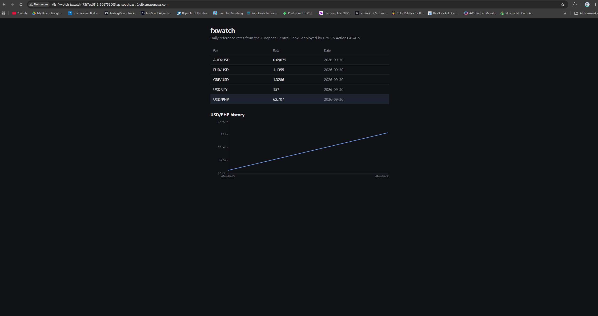

**ArgoCD Applications**
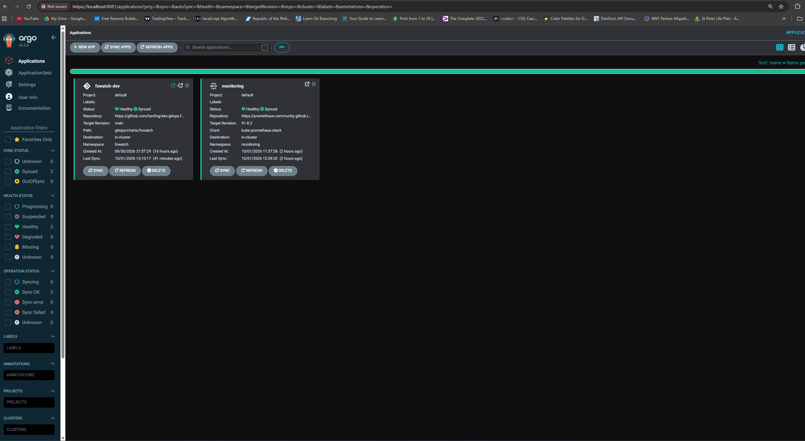

**ArgoCD Application Tree**
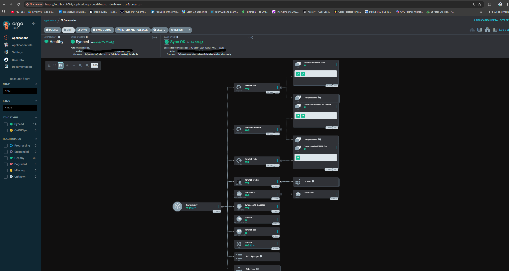

**ArgoCD Drift Detection**


**Grafana Dashboard**
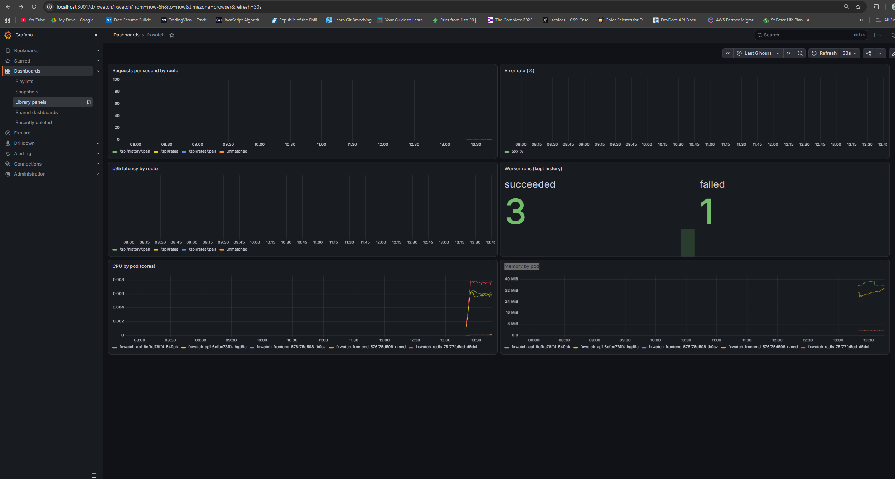

**GitHub Actions Run**
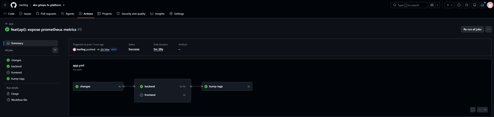

**GitHub Actions Security**
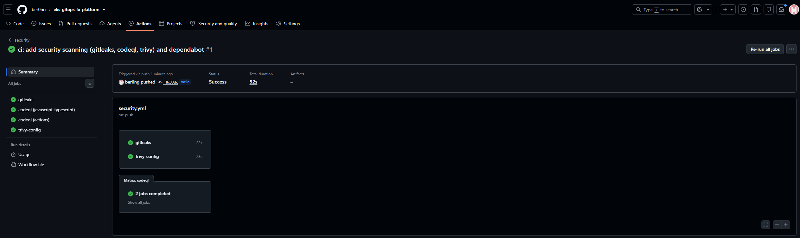

**GitHub Dependabot**
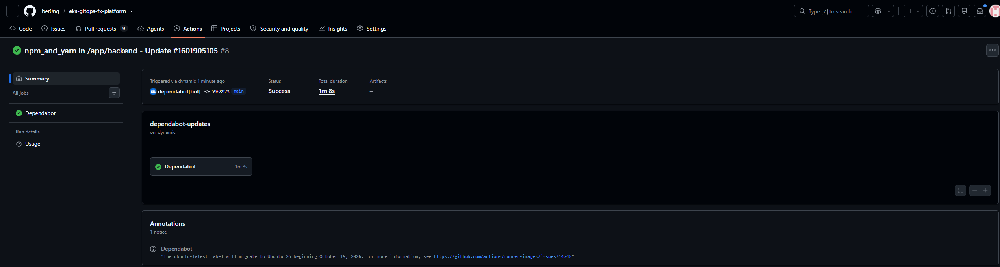

**Terraform Plan on PR**
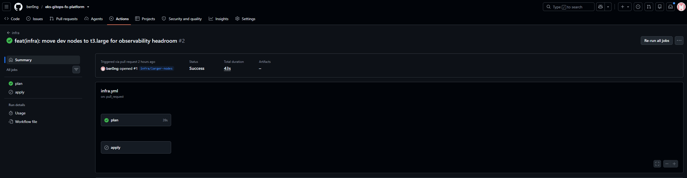

**Amazon EKS Dashboard**
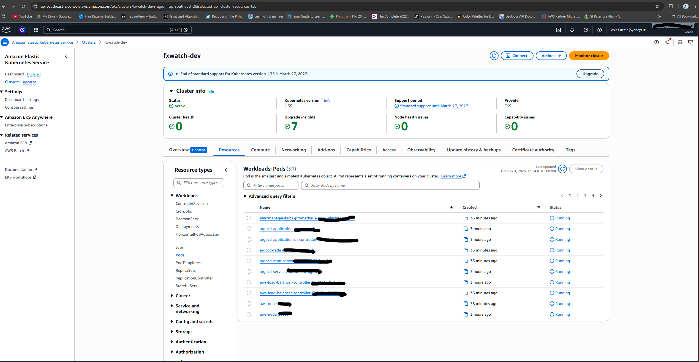
